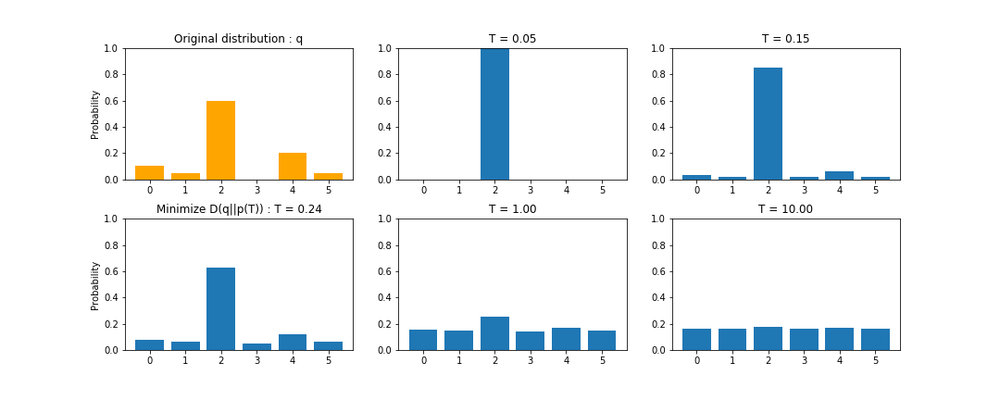

確率の先鋭化と平滑化のまとめ + 簡単な文書生成に応用
===
 
最近．分子デザインの論文[1]を読んでいるのですが，確率の最スケーリング（rescaling）の話があったのでまとめてみました．
 
確率の再スケーリングは，離散確率分布の先鋭化（sharpening）や平滑化（smoothing）に使われます．

確率の先鋭化とは，高い確率をより高い確率に，低い確率をより低い確率に変換する操作です．
この操作によって，離散確率分布はOne-Hotな確率分布（ある要素のみ1それ以外は0）に近づきます．

一方で，確率の平滑化は，確率分布をなだらかにする操作です．
離散確率分布を一様分布に近づける操作となります．

 

先鋭化と平滑化は，サンプル生成を確率分布を調整ときに用いられます．
自然言語処理の文書生成で先鋭化をもちいると，よりよく使われる文章が生成されます．
一方，平滑化を用いると，幅広い文章が生成されます．

この考え方は，自然言語処理のみではなく，教師なしクラスタリングや分子デザイン生成など，さまざまなところで用いられます．
 
ここでは，再スケールイング方法を2つほど紹介し，簡単な文章生成の問題で試してみます．

## Thermal Rescaling
統計力学で使われるボルツマン分布を利用した手法です．
再スケーリング前の確率分布を$q_i$，再スケーリング後の確率分布を$p_i$とすると，Thermal Rescalingは以下のようになります．

$$
p_i = \frac{\exp(\frac{q_i}{T})}{\sum_{j}\exp(\frac{q_j}{T})}
$$

ここで，Tは温度パラメーターであり，Tが小さいと先鋭化され，Tが大きいと平滑化されます．
Thermal Rescalingによる確率分布の変化は以下のようになります．

 

Thermal Rescalingの特徴は以下の3点となります．
1. Tが0に近づくとOne-Hotな確率分布"v"に近づく.
2. Tが大きくなると一様分布"u"に近づく．
3. 変換前の確率分布と一致する温度パラメーター"T"があるとは**限らない**.

特徴3の系として，確率が0の要素が保存されないという特徴が重要です（上の図の要素3）.
この問題によって，再スケーリング前に想定していた確率分布のルールを壊す可能性があります．

以下には再スケールング後の分布と（A）もとの分布q,（B）一様分布u,（C）One-hotな確率分布vとのそれぞれのKL情報量を示します．


 

Tが0に近づくとOne-hotな確率分布vとのKL情報量は0に近づき，Tが大きくなると一様分布uとのKL情報量0に近づきます．
一方，もとの分布qとのKL情報量が0に近づくことはありません．

コードというほどではないですが，numpyを用いるなら以下のようになります．

```python
# もとの離散確率分布
q = np.array([0.1,0.05,0.6,0,0.2,0.05])
# 温度パラメーター
T = 0.05
# 再スケーリング
p = np.exp(q/T) / np.sum(np.exp(q/T))
```

## Freesing function

確率を指数倍する再スケーリング手法として，Freesing functionがあります．
教師なし学習手法，Deep Embedded Clustering (DEC)[2]にも，この考え方が用いられています．
再スケーリング前の確率分布を$q_i$，再スケーリング後の確率分布を$p_i$とすると，Freesing functionは以下のようになります．

$$
p_i = \frac{q_i^{\frac{1}{T}}}{\sum_{j}q_j^{\frac{1}{T}}}
$$

Thermal Rescalingと同様に，Tは温度パラメーターであり，Tが小さいと先鋭化され，Tが大きいと平滑化されます．
Thermal Rescalingによる確率分布の変化は以下のようになります．

 

Freesing functionの特徴は以下の3点となります．
1. Tが0に近づくとOne-Hotな確率分布"v"に近づく.
2. Tが大きくなってもと一様分布"u"に近づくとは**限らない**．
3. T=1の時, 変換前の確率分布と一致する.

Thermal rescalingとは異なり，確率0の要素が保存されます.
そのため，確率0の要素があると，平滑化によって一様分布にはなりません. 

以下には再スケールング後の分布と（A）もとの分布,（B）一様分布u ,（C）One-hotな確率分布vとのそれぞれのKL情報量を示します．
（D(u||p)は計算できないのでD(p||u)を計算した．）

 

Thermal rescalingと同様に，Tが0に近づくとOne-hotな確率分布vとのKL情報量は0に近づきますが，Tが大きくなっても一様分布uとのKL情報量0に近づきません．
一方で，T=1のとき，もとの分布qとのKL情報量は0に収束します．


コードというほどではないですが，numpyを用いるなら以下のようになります．

```python
# もとの離散確率分布
q = np.array([0.1,0.05,0.6,0,0.2,0.05])
# 温度パラメーター
T = 0.2
# 再スケーリング
p = q**(1/T) / np.sum(q**(1/T))
```

## 文書生成への応用

以下の3つの文を学習に使います．
```
I have a pen. 
I have a dog. 
I buy a pen.
```

今回， 文章生成のモデルは簡単な，1-gramを用います． 
1-gramを用いて10文ほど作成すると，以下のようになります．
```
 [SoS] I have a pen [EoS]
 [SoS] I have a pen [EoS]
 [SoS] I have a pen [EoS]
 [SoS] I have a pen [EoS]
 [SoS] I have a pen [EoS]
 [SoS] I have a dog [EoS]
 [SoS] I have a pen [EoS]
 [SoS] I buy a dog [EoS]
 [SoS] I buy a dog [EoS]
 [SoS] I have a pen [EoS]
```
一定の乱雑な，文章が生成されます．

まず，Freesing functionを用いて，先鋭化した文章は以下のようになります（T=0.1）．

```
 [SoS] I have a pen [EoS]
 [SoS] I have a pen [EoS]
 [SoS] I have a pen [EoS]
 [SoS] I have a pen [EoS]
 [SoS] I have a pen [EoS]
 [SoS] I have a pen [EoS]
 [SoS] I have a pen [EoS]
 [SoS] I have a pen [EoS]
 [SoS] I have a pen [EoS]
 [SoS] I have a pen [EoS]
```
"I" のあとに"have"をつかい，"a" のあとに"pen"をつかう学習用の文が多くいため，先鋭化により1つの文章のみが生成されるました．

次に，Freesing functionを用いて，平滑化した文章は以下のようになります（T=2.0）．

```
 [SoS] I have a dog [EoS]
 [SoS] I buy a dog [EoS]
 [SoS] I have a pen [EoS]
 [SoS] I have a pen [EoS]
 [SoS] I have a pen [EoS]
 [SoS] I have a dog [EoS]
 [SoS] I buy a dog [EoS]
 [SoS] I buy a pen [EoS]
 [SoS] I buy a pen [EoS]
 [SoS] I have a dog [EoS]
```
"I" のあとに"buy"をつかうサンプルが増加していますが，文章のルールが崩れることはありません．

最後に，Thermal rescalingを用いて，平滑化した文章は以下のようになります．(T=1.0)
```
 [SoS] a I have dog I have I [EoS]
 [SoS] [EoS]
 [SoS] have [SoS] I buy [EoS]
 [SoS] a a [EoS]
 [SoS] [SoS] [SoS] [EoS]
 [SoS] [EoS]
 [SoS] a buy a dog dog [SoS] I dog pen pen pen buy pen [EoS]
 [SoS] dog buy a I pen I have buy I buy a dog [EoS]
 [SoS] dog buy buy I dog a pen have dog pen [EoS]
 [SoS] I [SoS] buy dog [SoS] a pen pen [EoS]
```
文のルールが壊れます．
Thermal rescalingは確率0の要素を保存しないことが原因です．


以下に文章生成のコードを示します．．

```python
import numpy as np

corpus = "I have a pen. I have a dog. I buy a pen."
# 文に分ける
sentences =  corpus.split('.')
# 空文の削除と[SoS],[EoS]の付加
sentences = ['[SoS] ' + s + ' [EoS]' for s in sentences if s != '']
# [EoS]→[EoS]の追加
sentences.append("[EoS] [EoS]")
# ダブルスペースの削除
sentences = [s.replace('  ',' ')  for s in sentences]
# ワードに分ける
words =[]
for s in sentences:
    words.append(s.split(' '))
# ワードリストの作成
word_list = ['[SoS]'] + list(set(sum(words,[])) - set(['[SoS]','[EoS]'])) + ['[EoS]']
# ワードリストを要素番号に変換
num_list = np.arange(len(word_list))
word_dict = dict(zip(word_list,num_list))
#遷移確率の作成
A = np.zeros((len(word_list),len(word_list)))
for s in words:
    for i in range(len(s) - 1):
        #数え上げ         
        A[word_dict[s[i+1]],word_dict[s[i]]] +=1
A = A / A.sum(axis = 0)
# Originalの文書生成
sentences_g = []

for i in range(10):
    #最初は[SoS]
    w = [0]
    while True:
        # 次の確率分布
        q = A[:,w[-1]]
        # sampling and append
        w.append(np.argmax(np.random.multinomial(1,q)))
        # if EoS then break
        if w[-1] == len(word_list)-1:
            break;
    # 文字列に変換            
    s = ''
    for i in w:
        s = s + ' ' +word_list[i]  

    #文書の追加 
    sentences_g.append(s)
# 表示
for s in sentences_g:
    print(s)
```

Freesing functonによるsharpeningのコード:
```python
#  Sharpening by Freesing : T = 0.1
T = 0.1
sentences_g = []
for i in range(10):
    w = [0]
    while True:
        q = A[:,w[-1]]
        # 再スケーリング
        p = q**(1/T) / np.sum(q**(1/T))
        w.append(np.argmax(np.random.multinomial(1,p)))
        if w[-1] == len(word_list)-1:
            break;
    s = ''
    for i in w:
        s = s + ' ' +word_list[i]  
    sentences_g.append(s)
for s in sentences_g:
    print(s)
```

Thermal Rescalingによるsmoothingのコード:

```python
#  Smoothing by Thermal : T = 1.0
T = 1.0
sentences_g = []
for i in range(10):
    w = [0]
    while True:
        q = A[:,w[-1]]
        # 再スケーリング
        p = np.exp(q/T) / np.sum(np.exp(q/T))
        w.append(np.argmax(np.random.multinomial(1,p)))
        if w[-1] == len(word_list)-1:
            break;
    s = ''
    for i in w:
        s = s + ' ' +word_list[i]  

    sentences_g.append(s)
for s in sentences_g:
    print(s)
```

## 偏りをつけて再スケーリングしたい場合
ある要素が現れやすい再スケールングをする場合があります．
その場合は，Gumbel-softmax関数[3]などを使うといいかもしれません．

再スケーリング前の確率分布を$q_i$，再スケーリング後の確率分布を$p_i$とすると，Gumbel-Softmax関数は以下のようになります．

$$
p_i = \frac{\exp(\frac{\log(q_i)+ g_i}{T})}{\sum_{j}\exp(\frac{\log(q_j)+ g_j}{T})}
$$

ここで，Tは温度パラメーターであり，今までの再スケーリングと同様に，Tが小さいと先鋭化され，Tが大きいと平滑化されます．
また，g_iは再スケーリング際に，優先度合いを決めるパラメーターです．
論文では，g_iを以下の分布から生成しています．

$$
g_i = -\log (-\log u),\quad u\sim {\rm Uniform}(0, 1)
$$

Gumbel-Softmax関数以外にも，偏りをつけて再スケーリングする手法はあると思います．
状況に応じて使っていきたいです．

## まとめ

確率0の要素を保持したい場合はFreesing functionを使い，確率0の要素を保持したくない場合はThermal Rescalingを使うのがいいと思います．

## code
https://github.com/yuji0001/2020GenerativeModel

## Author
Yuji Okamoto: yuji.0001@gmail.com

## Reference
[1] Elton, D. C., Boukouvalas, Z., Fuge, M. D., & Chung, P. W. (2019, August 1). Deep learning for molecular design - A review of the state of the art. Molecular Systems Design and Engineering, Vol. 4, pp. 828–849. https://doi.org/10.1039/c9me00039a

[2] Xie, J., Girshick, R., & Farhadi, A. (2015). Unsupervised Deep Embedding for Clustering Analysis. 48. Retrieved from http://arxiv.org/abs/1511.06335

[3] Jang, E., Gu, S., & Poole, B. (2019). Categorical reparameterization with gumbel-softmax. 5th International Conference on Learning Representations, ICLR 2017.